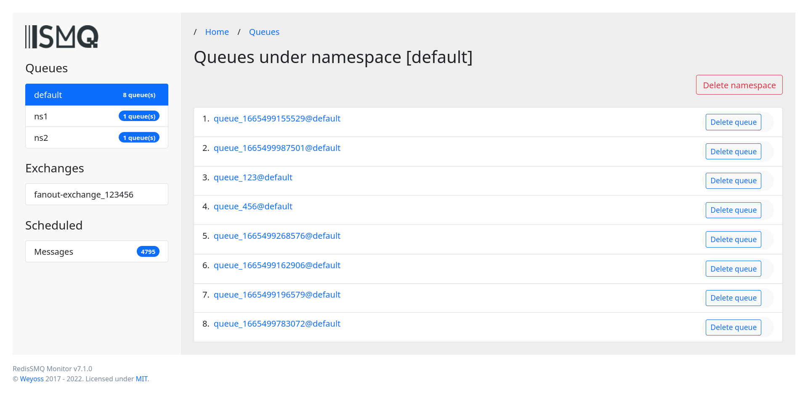

  

  
A simple high-performance Redis message queue for Node.js.

# RedisSMQ Monitor Client

    
    

RedisSMQ Monitor Client is a Web UI for [the RedisSMQ Monitor application](https://github.com/weyoss/redis-smq-monitor). 

From your browser, it allows you to manage RedisSMQ in real-time. The Web UI is shipped with the `redis-smq-monitor` 
package. To start using it, you need to install and configure the [RedisSMQ Monitor](https://github.com/weyoss/redis-smq-monitor).

[More screenshots can be found here](./screenshots).

## License

[MIT](https://github.com/weyoss/redis-smq-monitor-client/blob/master/LICENSE)